# Facial Emotion Detection Using Emotion Augmentations Generated By GAN 

## Background:

The purpose of our project is to enhance the accuracy of emotion recognition models using generative adversarial network (GAN). We aim to improve the model's performance by leveraging EmotionGAN for (1) creating new augmentations (multiple variations of a single emotion); (2) generating more labeled images and increasing our trained dataset.


## EmotionGAN:

Our work is based on [GANmut](https://github.com/stefanodapolito/GANmut) - a generative adversarial network (GAN) specifically trained for generating facial expressions corresponding to different emotions.
It describes the gamut of human emotions in a learnable conditional space, where semantically similar emotions are represented by close points in the conditional space. We will refer this model from now as EmotionGAN.  

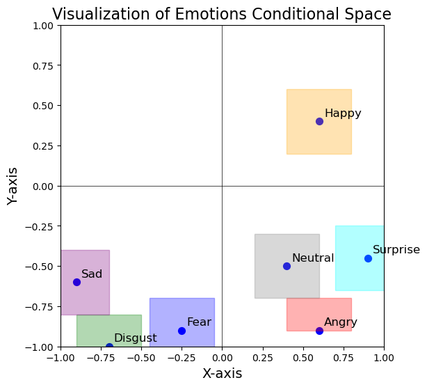  

The trained EmotionGAN model takes an input image and a point in the conditional space, and transforms the facial expression in the image to the emotion represented by the given point.
Thereby, we were able to create variations of the same person with different emotional expressions.

*Illustration for EmotionGAN:*  
  


## Dataset:

In order to train a deep learning model for emotion recognition, a large labeled dataset is required for achieving high accuracy results. However, collecting such dataset is not a simple task as it might come across with ethical problems. The dataset we used in this project is FER2013 dataset, which contains approximately 35K labeled images. In particular, the training set consists of 28,709 images, the validation set consists of 3,587 images and the test set consists of 3,587 images. Each image in the dataset is labeled to one of the following emotions:  Angry,  Disgust, Fear, Happy, Sad, Surprise, and Neutral.  
The dataset is significantly unbalanced. In one of our experiments, we applied a dataset expansion method with EmotionGAN (detailed below), and succeeded in achieving much more balanced dataset.

*Training set label's distribution - before and after:*

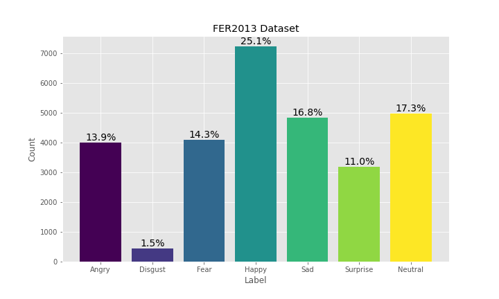   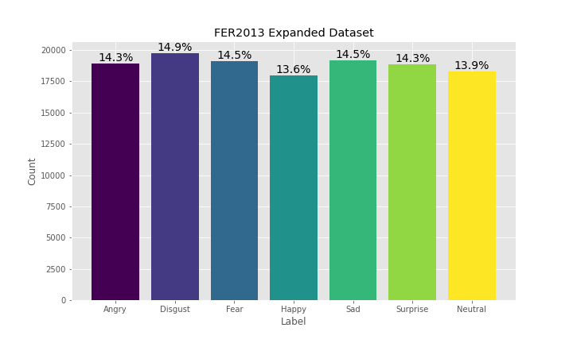  


## Methods for Improving Model's Accuracy:

We used EmotionGAN to examine the following approaches:

#### Creating Emotion Augmentation:

We applied augmentations to the images in the dataset by mapping the image to a point in the neibourhood of the original emotion of the image. Hereby, creating variations of the same person with the same emotional expression.

*Here are some examples for emotion augmentations:*

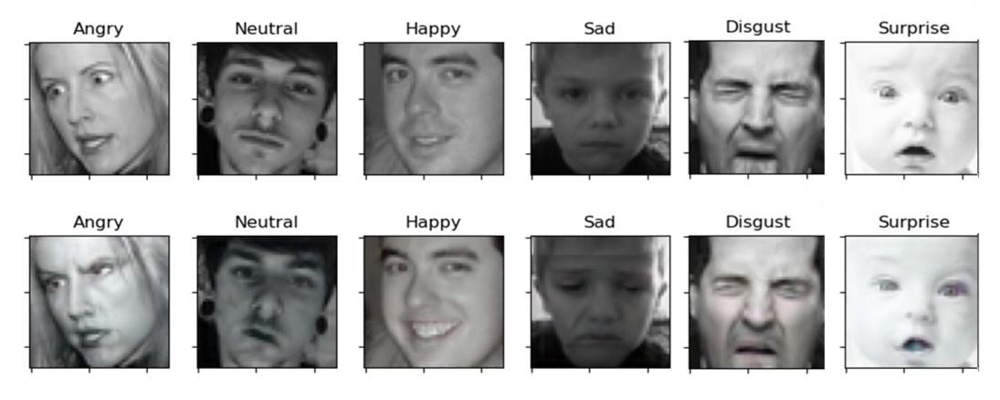

#### Expanding The FER2013 Dataset:

For each image in the training set, we were able to change it's emotion to the other 6 available emotions. Therefore, resulting variations of the same person with different emotional expressions.

*Here are some examples for dataset expansion, based on image from the original dataset:*

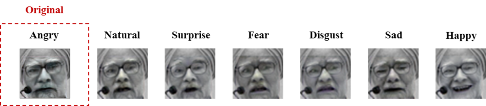

## Summary for the entire system:

We used known pre-trained models within this project. Specifically, we examined ResNet18 and Densenet201. Since feature-extraction has resulted poor accuracy, we fine-tuned the models in order to increase the ability of the model to generalize the dataset.


## Optuna

Using Optuna, a hyper-parameter optimization framework to automate hyper-parameter search, we were able to examine multiple options of hyper-parameters.
We ran semi-training process on each pre-trained model with few epochs and a smaller training set, and chose the hyper-parameters that achieved the best accuracy on the validation set.

We used the Cross Entropy loss function, and the hyper parameters that were tested are: Batch Size, Optimizer, Learning Rate, Weight Decay and Scheduler.

*In the chart below there is a demonstration for the optuna trials on ResNet18 Net:*

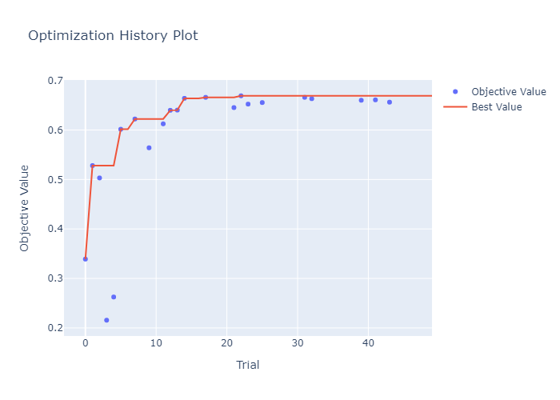


The hyper parameters that were finally chosen are:
| Model | Batch Size | Optimizer | Learning Rate | Weight Decay | Scheduler |
|-------|------------|-----------|---------------|--------------|-----------|
| ResNet18 | 128 | Adam | 2e-4 | 2e-5 | CosineAnealingLR |
| DenseNet201 | 32 | Adam | 3e-4 | 3.4e-5 | CosineAnealingLR |


## Results:

We used 2 pretained models, and ran 3 types of training trials on each pre-trained model:

* **Baseline** - fine tune a pre-trained model without the EmotionGAN augmentations.
* **EmotionGan Augmantation** -  fine tune a pre-trained model with the implementation of EmotionGAN augmentations during the training process. 
* **Expanded Dataset** - fine tune a pre-trained model on the expanded dataset, with new images generated using EmotionGAN.

### Top 1 Results:

| Model | Baseline | EmotionGAN Augmentations | Expanded Dataset | Combined Model (Max-Vote) |
|--------|---------|----------------|----------------|------------------|
| ResNet18 | 70.16% | 69.6%  | 69.55% | **71.69%** |
| DenseNet201 | 70.29% | 69.57% | 68.1% | **71.61%** |


### Top 2 Results:

| Model | Baseline | EmotionGAN Augmentations | Expanded Dataset |
|--------|---------|----------------|----------------|
| ResNet18 | 84.93% | **84.95%**  | 84.48% |
| DenseNet201 | 84.76% | **84.87%** | 84.29% |
 

#### Training and Validation Accuracy During Training Epochs:
| Model | Baseline | EmotionGAN Augmentations | Expanded Dataset |
|---|----------------|----------------|----------------|
|Resnet18|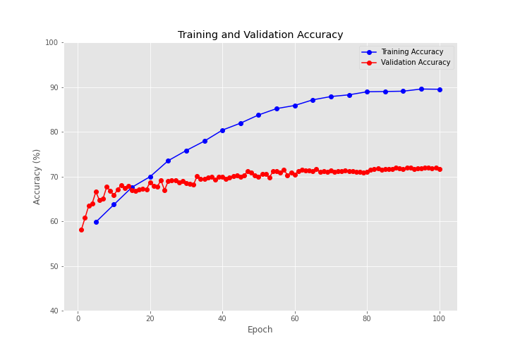|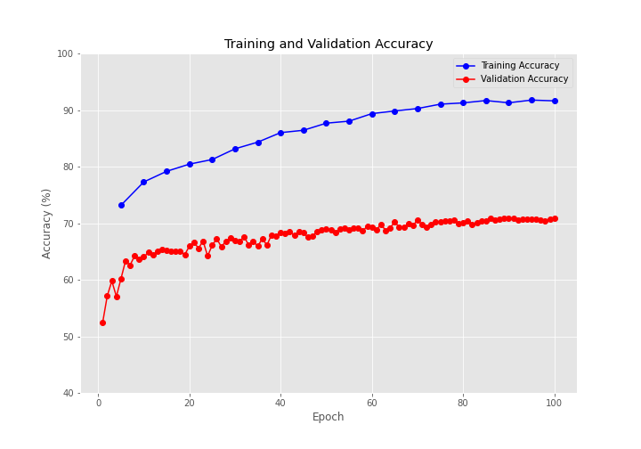|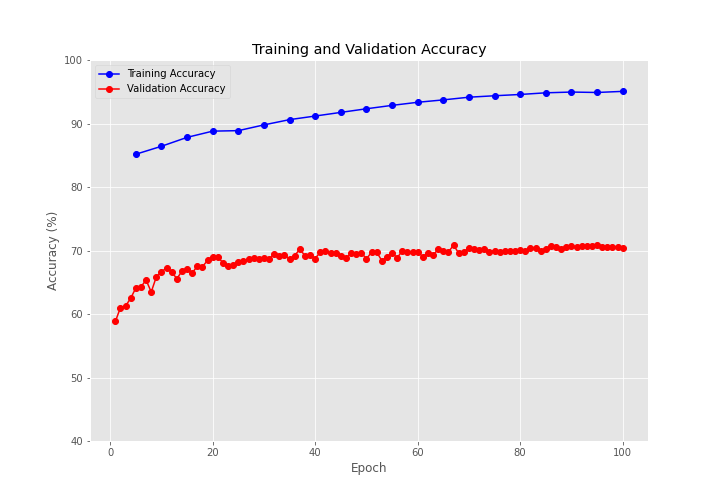|
|DenseNet201|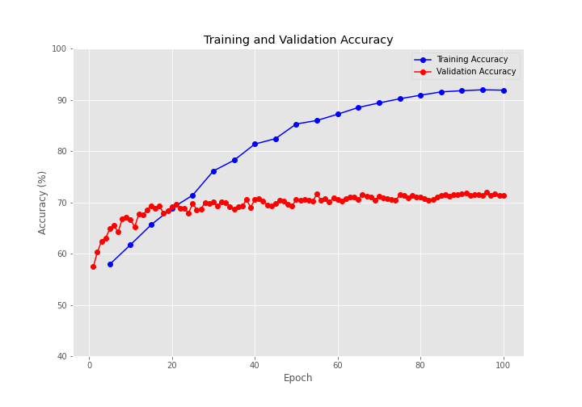|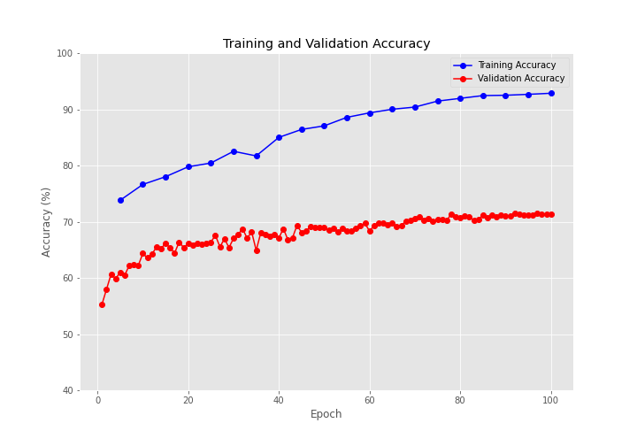|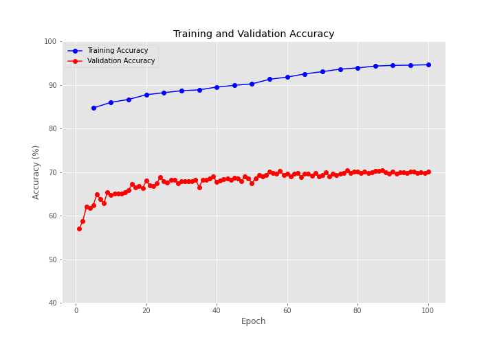|


#### Confusion Matrices On TestSet Of All Experiments - ResNet18:

   
   

## Summary & Conclusions:

In order to improve the accuracy rate and robustness on emotion recognition task, we took two different pre-trained models, and tried to improve the training process using EmotionGAN. Those augmentations were carried out according to the label of each image, in order to keep the original emotion of the source image. 

At the end, the emotion augmentations method indeed helped the model during the training process, by probably made it easier to learn the emotions. But overall, it didn't help the generalization. One possible explanation to the gap between the improvement of the training accuracy, but almost no change in the validation or test accuracy, is that the augmentations provide much more separable emotions. That is, one sad image becomes much more sadder, and the sad-emotion takes over the entire  face expression. Thus, in the training process this emotion "got far" from other emotions. But, FER2013 contains images with much more ambiguous emotions. In this case, it could cause the degradation in the performances when the model adapt itself to the exaggerated augmentations.

With T-SNE approach, we can see that the augmented model indeed was able to separate the augmented emotions better then the baseline model on the original images. Please notice that the baseline model's T-SNE plot was generated with original samples from the dataset, while the augmented model's T-SNE plot was generated using augmented samples. Here we are showing the ResNet18 results, at the beginning of the **training** (after 20 epochs):

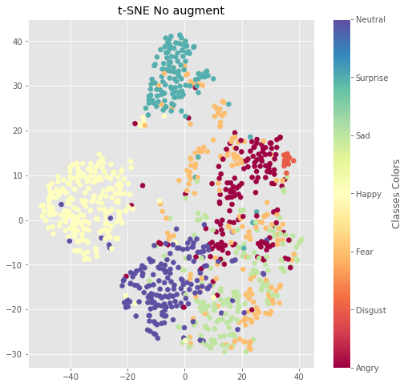  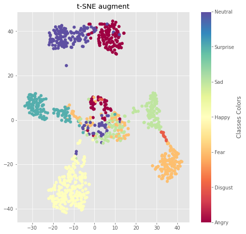

On another point of view, as the training process was a bit different between the 3 methods, we could see some improvements on different categories. By utilizing the 3 methods, while taking the combination of their predictions, we were able to improve the overall accuracy and benefit from the augmentation process. Moreover, looking at the the top-2 task, the augmentations slightly improved the results compared to the baseline. This can indicate the potential of emotions augmentations if they are being used with more specific method. 

To summarize, it looks like EmotionGAN augmentations are not very suited for emotion recognition task on FER2013 dataset. But, EmotionGAN is good for creating separable emotions, and can be used as a method for training complementary model. Then, with the combination with another model (using some enssamble learning technique), it can help to achieve better results.

## Installation:

### How to Use:

1. Clone the repository:
    ```bash
    git clone https://github.com/reuvensm/Emotion-Detection-Using-EmotionGAN.git
    ```

2. Navigate to the project directory:
    ```bash
    cd Emotion-Detection-Using-EmotionGAN
    ```

3. Install the required dependencies:
    ```bash
    pip install -r requirements.txt
    ```

4. Load the FER2013 Dataset to the project directory:
    ```bash
    mkdir -p data/fer2013
    mv <download_path>/icml_face_data.csv data/fer2013/icml_face_data.csv
    ```

5. Choose the appropriate script accroding to the desired task and read the help prompt / see [How to Run](#How-to-Run) section for further explaination
    ```bash
    # For your conviance, the following scripts have "help" prompt that can be activated
    
    # For creating augmentations:
    python create_augmentations.py --help
    # For running optuna trails:
    python optuna_study.py --help
    # For training emotion model:
    python train_model.py --help
    # For training BYOL model:
    python train_byol_model.py --help
    ```


### How to Run


### Creating Augmentations And Dataset Expension:

```bash
python create_augmentations.py \
--dataset {default=fer2013}
--dest_folder {default=data/fer2013_augmentations}
--num_augments {default=10}
--expand_dataset {default=False}
--folder_batch_size {default=100}
```

`dataset`: Meant for future integration of other datasets. Currently only available option is `fer2013`.  
`dest_folder`: Base folder for output to be saved in.  
`num_augments`: In case of creating augmentations - how many to generate from each image (later in the training process, one augment of the generated ones will be picked randomly every epoch).  
`expand_dataset`: Use for generating new images for the dataset instead of creating augmentations.  
`folder_batch_size`: In case of creating augmentations - break the output folder to `folder_batch_size` folders for faster search in the file system.

#### Use in current project:
```bash
# Creating augmentations
python create_augmentations.py --dataset fer2013 --dest_folder data/fer2013_augmentations --num_augments 10
# Expanding the dataset:
python create_augmentations.py --dataset fer2013 --dest_folder data/expanded_fer_2013 --expand_dataset True
```


### Running Optuna Trials:

```bash
python optuna_study.py \
--net_name
--exp_name {default='Regular'}
--plot_results {default=None}
--byol {default=False}
```

`net_name`: One of the supported architectures: `resnet18`, `densenet201`.  
`exp_name`: Identifying string for current experiment. Will be used for output filenames.  
`plot_results`: Path to pkl with results of previous study. New optuna study won't be launched using this option.  
`byol`: Use BYOL model instead of regular CNN classifer architecture.


#### Output Files:

```bash
optuna_study_output/optuna_study_results_<net_name>_<exp_name>.pkl
optuna_study_output/param_importances_<net_name>_<exp_name>.png
optuna_study_output/optimization_history_<net_name>_<exp_name>.png
```

#### Use in current project:
```bash
python optuna_study.py --net_name [resnet18 | densenet201] --exp_name Regular
```


### Training Model:

```bash
python train_model.py \
--net_name
--exp_name
--epochs {default=100}
--emotion_transform_prob
--use_expanded_dataset {default=False}
--fine_tune {default=False}
--load_byol {default=False}
--verbose {default=False}
```

`net_name`: One of the supported architectures: `resnet18`, `densenet201`.  
`exp_name`: Identifying string for current experiment. Will be used for output filenames.  
`epochs`: For how many epochs to train the model.  
`emotion_transform_prob`: Probabililty between `0` to `1` for EmotionGAN to use augmentation for image (note that in case there are no augmentations available for specific image, it won't be used). Will be ignored when `use_expanded_dataset` is `True`.  
`use_expanded_dataset`: Use expanded dataset.  
`fine_tune`: Fine-tune the model instead of just feature-extract.  
`load_byol`: Load the trained BYOL model's weights of the same `net_name` and `exp_name` and continue training it.  
`verbose`: Print to the log file a status line every 100 iterations of the training process.


#### Output Files:

```bash
# Models Checkpoints:

checkpoints/ckpt_<net_name>_<exp_name>_best_validation.pth  # Best validation result
checkpoints/ckpt_<net_name>_<exp_name>_last_trained_epoch.pth  # Last epoch result (saved and overwritten after every epoch)
checkpoints/ckpt_<net_name>_<exp_name>_final_checkpoint.pth # Result in the end of training

# Plots:
plots_output/train_accuracy_<net_name>_<exp_name>.png  # Train accuracy over epochs
plots_output/validation_accuracy_<net_name>_<exp_name>.png  # Validation accuracy over epochs
plots_output/confusion_matrix_<net_name>_<exp_name>.png  # Confusion Matrix

# Log:
logs/training_<execution_timestamp>.log
```


#### Use in current project:
```bash
# Baseline:
python train_model.py --net_name [resnet18 | densenet201] --exp_name Regular --epochs 100 --emotion_transform_prob 0 --fine_tune True

# Emotion augmentations:
python train_model.py --net_name [resnet18 | densenet201] --exp_name Augmented --epochs 100 --emotion_transform_prob 0.8 --fine_tune True

# Expanded dataset:
python train_model.py --net_name [resnet18 | densenet201] --exp_name Expanded --epochs 100 --fine_tune True --use_expanded_dataset True
```


### Training BYOL Model:

```bash
python train_byol_model.py \
--net_name
--exp_name
--epochs {default=100}
--fine_tune {default=False}
```

`net_name`: One of the supported architectures: `resnet18`, `densenet201`.  
`exp_name`: Identifying string for current experiment. Will be used for output filenames.  
`epochs`: For how many epochs to train the model.  
`fine_tune`: Fine-tune the model instead of just feature-extract.


#### Output Files:

```bash
# Models Checkpoints:

checkpoints/ckpt_byol_<net_name>_<exp_name>_best_validation.pth  # Best validation result
checkpoints/ckpt_byol_<net_name>_<exp_name>_last_trained_epoch.pth  # Last epoch result (saved and overwritten after every epoch)
checkpoints/ckpt_byol_<net_name>_<exp_name>_final_checkpoint.pth # Result in the end of training

# Log:
logs/training_<execution_timestamp>.log
```


### Repository Overview

| Folder | Description |
|--------|-------------|
|EmotionGAN|Code files from GANmut Repository, with few modifications for integrating it with our project.|
|core_code/datasets|Implementation of pytorch Dataset objects, that handle fetching the augmented images and the expanded dataset images.|
|core_code/models|Implementation of pytorch nn models - one for EmotionNet - a generic object that can load pretrained models, and one for BYOL model.|
|core_code/core_utils|Auxillary functions that handle common operations such as saving models, logging and generating plots.| 


## Sources & References:

- [**GANmut Paper**](https://ink.library.smu.edu.sg/cgi/viewcontent.cgi?article=7412&context=sis_research): Stefano d’Apolito, Danda Pani Paudel, Zhiwu Huang, Andres Romero, and Luc Van Gool. Ganmut: Learning interpretable conditional space for gamut of emotions. In 2021 IEEE Conference on Computer Vision and Pattern Recognition, CVPR 2021, 2021.

- [**GANmut on GitHub**](https://github.com/stefanodapolito/GANmut)

- [**FER2013 Dataset**](https://www.kaggle.com/datasets/nicolejyt/facialexpressionrecognition)

- [**Facial Expression Recognition using Residual Masking Network**](https://github.com/phamquiluan/ResidualMaskingNetwork): Previous work on the fer2013 dataset.
